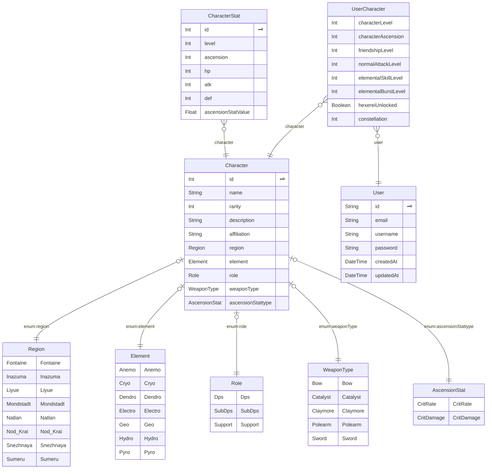

```mermaid
erDiagram

        Region {
            Fontaine Fontaine
Inazuma Inazuma
Liyue Liyue
Mondstadt Mondstadt
Natlan Natlan
Nod_Krai Nod_Krai
Snezhnaya Snezhnaya
Sumeru Sumeru
        }
    


        Element {
            Anemo Anemo
Cryo Cryo
Dendro Dendro
Electro Electro
Geo Geo
Hydro Hydro
Pyro Pyro
        }
    


        Role {
            Dps Dps
SubDps SubDps
Support Support
        }
    


        WeaponType {
            Bow Bow
Catalyst Catalyst
Claymore Claymore
Polearm Polearm
Sword Sword
        }
    


        AscensionStat {
            CritRate CritRate
CritDamage CritDamage
        }
    
  "Character" {
    Int id "🗝️"
    String name 
    Int rarity 
    String description 
    String affiliation 
    Region region 
    Element element 
    Role role 
    WeaponType weaponType 
    AscensionStat ascensionStattype 
    }
  

  "CharacterStat" {
    Int id "🗝️"
    Int level 
    Int ascension 
    Int hp 
    Int atk 
    Int def 
    Float ascensionStatValue 
    }
  

  "User" {
    String id "🗝️"
    String email 
    String username 
    String password 
    DateTime createdAt 
    DateTime updatedAt 
    }
  

  "UserCharacter" {
    Int characterLevel 
    Int characterAscension 
    Int friendshipLevel 
    Int normalAttackLevel 
    Int elementalSkillLevel 
    Int elementalBurstLevel 
    Boolean hexereiUnlocked 
    Int constellation 
    }
  
    "Character" |o--|| "Region" : "enum:region"
    "Character" |o--|| "Element" : "enum:element"
    "Character" |o--|| "Role" : "enum:role"
    "Character" |o--|| "WeaponType" : "enum:weaponType"
    "Character" |o--|| "AscensionStat" : "enum:ascensionStattype"
    "CharacterStat" }o--|| "Character" : "character"
    "UserCharacter" }o--|| "User" : "user"
    "UserCharacter" }o--|| "Character" : "character"
```
